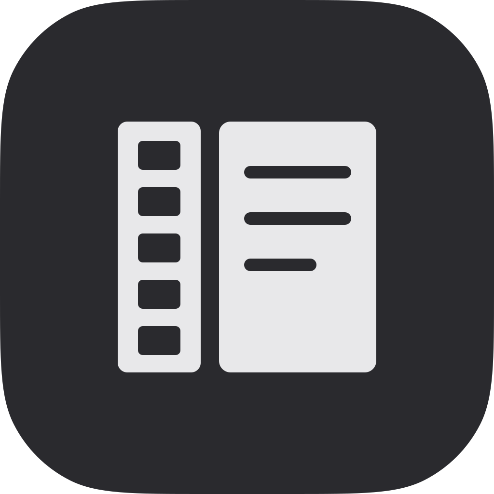

<p align="center">
  
</p>

# Video To Skill

[](https://github.com/Paldom/video-to-skill/actions/workflows/ci.yml)
[](LICENSE)
[](https://skills.sh/Paldom/video-to-skill)

Agent Skills that turn a YouTube video or local MP4 into a structured markdown knowledge base: transcript retrieval, audio transcription, slide and frame capture, chaptering, and distillation into linked notes.

Agent Skills for [Claude Code](https://code.claude.com/docs/en/skills) (and any
[Agent Skills](https://agentskills.io)-compatible tool). Each skill is a folder under
[`skills/`](skills/) with a single-purpose `SKILL.md`, trigger evals, and optional
scripts/references — validated on every write, commit, and PR.

## Quick start

Install with the [skills CLI](https://skills.sh) — auto-detects 70+ agents
(Claude Code, Codex, Cursor, Copilot, pi, …):

```bash
npx skills add Paldom/video-to-skill                  # all detected agents
npx skills add Paldom/video-to-skill -a codex -a pi   # or target specific agents
```

Or with the [GitHub CLI](https://cli.github.com/manual/gh_skill_install) (≥ 2.90),
including version-pinned installs from releases:

```bash
gh skill install Paldom/video-to-skill
gh skill install Paldom/video-to-skill <skill> --pin <tag>
```

Or as a Claude Code plugin:

```
/plugin marketplace add Paldom/video-to-skill
/plugin install video-to-skill@video-to-skill
```

Or copy a single skill into a project:

```bash
git clone https://github.com/Paldom/video-to-skill.git
cp -r video-to-skill/skills/<skill-name> your-project/.claude/skills/
```

Then just describe the task — the skill activates on its description — or invoke it
explicitly with `/<skill-name>`.

## Skills

| Skill | Description |
| --- | --- |
| [video-notes](skills/video-notes/) | Turns a YouTube URL or local video into one markdown knowledge note with inline screenshots and clickable timestamps back to the source. |
| [video-transcribe](skills/video-transcribe/) | Fetches a timestamped transcript — creator captions, then original-language auto-captions, then local Whisper — with a deterministic quality verdict. |
| [video-keyframes](skills/video-keyframes/) | Captures scene-change screenshots from a local video, OCRs them, and writes a timeline digest of what is on screen when. |

`video-notes` is the headline skill and drives the other two; both are useful on
their own. Running all three end to end:
[docs/setup-prompt.md](docs/setup-prompt.md).

### Requirements

`ffmpeg` (8.x recommended) and `yt-dlp` for URLs; `tesseract` for OCR (optional
— frames still work without it); `whisper.cpp` or `faster-whisper` for videos
with no captions. Each skill checks what it needs and prints the exact install
command rather than failing on a missing binary.

## Example

```
/video-notes https://www.youtube.com/watch?v=wykPErJ8M-8
```

One command. `video-notes` runs the other two skills, reads the timeline digest,
opens only the frames the evidence demands, and writes a `note.md` whose claims
carry clickable timestamps and whose key moments are embedded as screenshots.

Worked example on that video — the commands, the run output, and the note it
produced: [docs/example.md](docs/example.md).

## Repository structure

```
skills/                  # distributed skills, one folder per skill (SKILL.md + evals/ + scripts/)
docs/                    # skill-authoring guide, eval methodology, deployment guide
scripts/                 # deterministic validator used by hooks and CI
skills.sh.json           # skills.sh repo-page customization (groupings)
.claude/                 # agentic dev setup: hooks + bundled add-skill / publish-repo skills
.claude-plugin/          # plugin + marketplace manifests (makes this repo installable)
.local/                  # gitignored working area: sources, research, PROMPT.md (see below)
```

## Working on this repo with an agent

This repo is agent-native: canonical agent instructions live in
[AGENTS.md](AGENTS.md) (CLAUDE.md imports it), hooks validate every `SKILL.md` on
write, `make check` runs the full validator, and CI enforces the same gate on every
PR. The bundled `add-skill` skill walks the eval-first authoring workflow described
in [docs/skill-authoring.md](docs/skill-authoring.md). Maintainers drive sessions
with their own (gitignored, personal) `.local/PROMPT.md` goal prompt.

## Contributing

Contributions welcome — see [CONTRIBUTING.md](CONTRIBUTING.md) for the skill-proposal
process, the authoring workflow, and the PR checklist. Please note the
[Code of Conduct](CODE_OF_CONDUCT.md).

## Support

Questions, ideas, or something not working? Start with [SUPPORT.md](SUPPORT.md) —
bugs and skill proposals have [issue templates](../../issues/new/choose), and
security concerns go through [SECURITY.md](SECURITY.md) (never a public issue).

## License

[MIT](LICENSE) © 2026 Paldom
