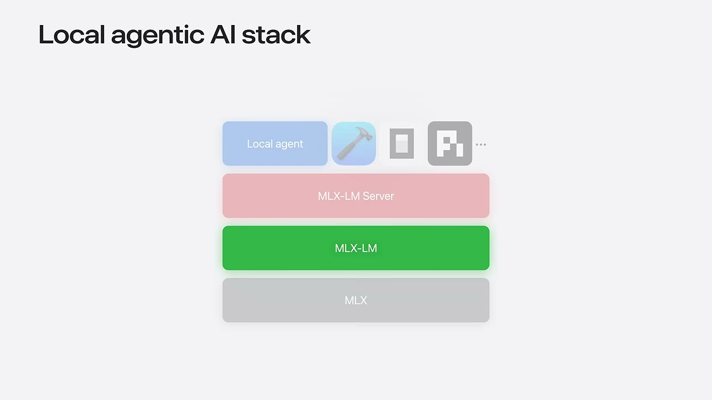
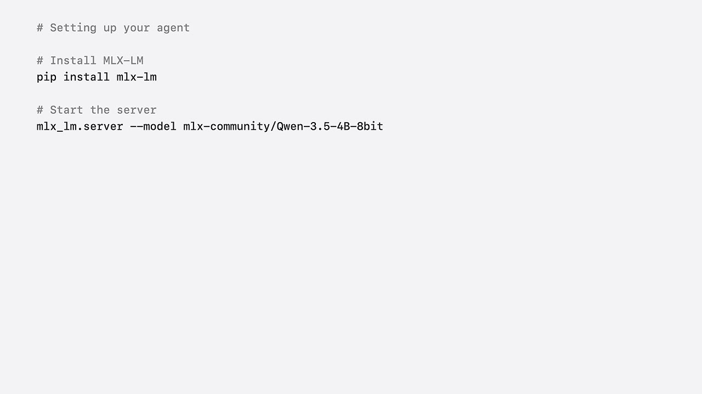
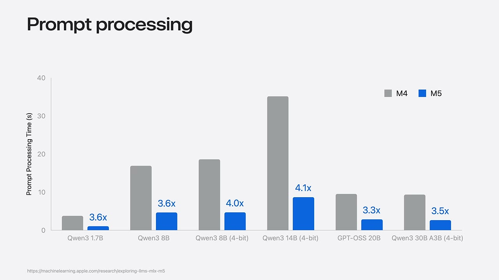

# Worked example: a WWDC26 talk

What `/video-notes` actually produces, end to end, on a real video:
[**WWDC26: Run local agentic AI on the Mac using MLX**](https://www.youtube.com/watch?v=wykPErJ8M-8)
(Apple Developer, 13:37).

## Invocation

```
/video-notes https://www.youtube.com/watch?v=wykPErJ8M-8
```

`video-notes` classified the genre as a slides-and-code talk, so it ran both
sibling skills. What they reported:

```jsonc
// video-transcribe — the caption ladder stopped at the top rung
{"kind": "manual", "segments": 232, "quality": "pass", "reasons": []}

// video-keyframes — threshold calibrated from this video's own scene scores
{"strategy": "scene", "scene_threshold": 0.01844,
  "frames_extracted": 136, "frames_kept": 50, "shots": 50}
```

Roughly 50 seconds of wall clock for the frame pass. The agent then read
`timeline.json` first and opened **3 of 50** frames.

## What the run exercised

Three behaviours the design exists for, all of which fired on this one video:

- **Dedup nearly ate the best slide.** Perceptual dedup collapsed the stretch
  from 03:27 to 08:07 — the whole "Setting up your own agent" chapter — to
  nothing. The post-dedup coverage check re-sampled the gap, which is the only
  reason the install commands appear in the note.
- **OCR read `pip install mlx-1m`.** The pixels say `mlx-lm`. Commands are read
  off the image, never off the OCR string.
- **A keyframe caught a chart mid-animation**, M5 bars not yet drawn.
  Re-sampling with `clip` recovered the finished chart, which shows a 3.3x-4.1x
  range where the narration says a flat "four times".

## The generated note

Reproduced verbatim below, image paths and all. The three frames the note
references are committed under `docs/frames/` so it renders exactly as produced;
the other 47 stayed local. They are stills from Apple's publicly available
developer session, reproduced here to document what the tool outputs.

### Frontmatter

```yaml
title: "WWDC26: Run local agentic AI on the Mac using MLX"
channel: "Apple Developer"
url: "https://www.youtube.com/watch?v=wykPErJ8M-8"
video_id: wykPErJ8M-8
source: youtube
published: 2026-06-08
duration: "00:13:37"
language: en
transcript_source: manual
transcript_quality: pass
processed: 2026-08-30
tags: [mlx, apple-silicon, local-llm, agents, inference]
```

### Body

# WWDC26: Run local agentic AI on the Mac using MLX

> Angelos, an engineer on the MLX team, shows how to run a complete agentic loop
> — model, tool calls, and agent — entirely on a Mac with no cloud and no API
> keys. The talk covers the four-layer stack, a three-step setup, the three
> performance problems local agents hit (prompt processing, concurrency, model
> size), and four live demos.

## Key takeaways

- The whole agentic loop runs locally on Apple silicon: data stays on the machine and there are no usage costs — [00:32](https://www.youtube.com/watch?v=wykPErJ8M-8&t=32s)
- The stack is four layers: MLX → MLX-LM → MLX-LM Server → any agent that speaks the OpenAI chat-completions protocol — [02:42](https://www.youtube.com/watch?v=wykPErJ8M-8&t=162s)
- Setup is three steps and one `pip install`; the server is a drop-in replacement for a cloud LLM API — [04:36](https://www.youtube.com/watch?v=wykPErJ8M-8&t=276s)
- M5 Neural Accelerators make matrix multiplication ~4× faster than M4, and this carries through almost exactly to prompt processing — [05:39](https://www.youtube.com/watch?v=wykPErJ8M-8&t=339s)
- Continuous batching serves parallel subagents without queueing; distributed inference spreads one model across several Macs — [06:53](https://www.youtube.com/watch?v=wykPErJ8M-8&t=413s)

## Chapters

| Time | Chapter | What happens |
| --- | --- | --- |
| [00:00](https://www.youtube.com/watch?v=wykPErJ8M-8&t=0s) | Introduction | Framing: agents moved from prototypes to daily tools |
| [00:32](https://www.youtube.com/watch?v=wykPErJ8M-8&t=32s) | The chat and agentic loop | Chat vs agent; live PR-summary demo |
| [02:42](https://www.youtube.com/watch?v=wykPErJ8M-8&t=162s) | Local agentic AI stack | The four layers |
| [04:36](https://www.youtube.com/watch?v=wykPErJ8M-8&t=276s) | Setting up your own agent | Three steps; OpenCode config |
| [05:39](https://www.youtube.com/watch?v=wykPErJ8M-8&t=339s) | Making agents fast | Prompt processing and M5 Neural Accelerators |
| [06:53](https://www.youtube.com/watch?v=wykPErJ8M-8&t=413s) | Concurrency and distributed inference | Continuous batching; multi-Mac sharding |
| [09:20](https://www.youtube.com/watch?v=wykPErJ8M-8&t=560s) | More examples | SwiftUI app from scratch; bug fix in Xcode |
| [13:01](https://www.youtube.com/watch?v=wykPErJ8M-8&t=781s) | Next steps | Recap and pointers |

<!-- Chapters are the creator's own, taken from metadata.json. -->

## Notes

### The agentic loop — [00:32](https://www.youtube.com/watch?v=wykPErJ8M-8&t=32s)

The distinction drawn is between chat (you send a prompt, you act on the reply)
and an agent (it talks to the model to decide, calls tools to do, observes the
result, and loops). Stated cycle: *user to agent, agent to model, agent to
tools*, repeating until the task is done.

The first demo has MLX serving the model on the left and OpenCode on the right,
asked to fetch recent PRs from the MLX repo, summarise them, and flag anything
needing attention. Only the `git` commands touch the network; the model runs
locally.

### The four-layer stack — [02:42](https://www.youtube.com/watch?v=wykPErJ8M-8&t=162s)



**Figure.** The stack slide, bottom to top: **MLX** (open-source array framework
for Apple silicon — Metal acceleration and memory management), **MLX-LM** (load,
run, quantize and fine-tune LLMs; thousands of HuggingFace models, CLI and Python
API), **MLX-LM Server** (OpenAI-compatible HTTP server with structured tool
calling and reasoning-model support), and the **agent** layer, shown as a row of
interchangeable clients. MLX-LM is highlighted in green as the layer the talk
builds on.

Because the server speaks the OpenAI chat-completions protocol, any agent works
unmodified — Xcode, OpenCode, Pi agent, or a custom script. Ollama, LM Studio and
vLLM are named as tools already built on MLX.

### Setting up your own agent — [04:36](https://www.youtube.com/watch?v=wykPErJ8M-8&t=276s)

Three steps: install, start the server, point the agent at it.

```bash
# verbatim from screen at [05:01]
# Install MLX-LM
pip install mlx-lm

# Start the server
mlx_lm.server --model mlx-community/Qwen-3.5-4B-8bit
```



**Figure.** The setup slide. The narration says only "run `mlx_lm.server` with a
model that supports tool calling" — **the concrete model identifier
`mlx-community/Qwen-3.5-4B-8bit` appears only on screen.** Anyone working from
the transcript alone would not have it.

For the agent side, the OpenCode example defines a local provider with the URL
set to localhost and the model name the server expects, then tells OpenCode to
use that model for everything.

### Prompt processing and the M5 — [05:39](https://www.youtube.com/watch?v=wykPErJ8M-8&t=339s)

The problem stated: in an agentic loop the model reprocesses all new tool output
before each step, and "agentic sessions usually comprise hundreds of thousands of
tokens, and most of those are not generated."



**Figure.** Prompt-processing time in seconds, M4 (grey) against M5 (blue), with
the speedup labelled per model. Measured points on screen: Qwen3 1.7B **3.6×**,
Qwen3 8B **3.6×**, Qwen3 8B 4-bit **4.0×**, Qwen3 14B 4-bit **4.1×**, GPT-OSS 20B
**3.3×**, Qwen3 30B A3B 4-bit **3.5×**. Source printed on the slide:
`https://machinelearning.apple.com/research/exploring-llms-mlx-m5`.

**Pixels refine the narration here.** The speaker says matrix multiplication is
"four times faster on M5 compared to M4" and that this "translates almost exactly
to prompt processing speedup". The chart shows a **range of 3.3×–4.1×** depending
on the model, not a flat 4×. Using the chart requires no code changes — MLX picks
the kernel for the available hardware.

### Concurrency and distributed inference — [06:53](https://www.youtube.com/watch?v=wykPErJ8M-8&t=413s)

Two further constraints:

- **Concurrency.** Agents spawn subagents that hit the model at once. MLX-LM
  Server uses **continuous batching** — requests are grouped dynamically on the
  GPU and a new request can join a batch already in progress, so subagents are
  not queued.
- **Model size.** Stated example: the most recent DeepSeek model has 1.6 trillion
  parameters and needs more than 800 GB for weights alone — beyond even a 512 GB
  machine. MLX's distributed support shards a model across Macs over Thunderbolt
  or Ethernet, launched with `mlx.launch` plus a hostfile describing the nodes and
  connection type.

From macOS 26.2 there is Thunderbolt RDMA support, with distributed inference
reported "up to three times" faster with four nodes. A companion session,
"Explore distributed inference and training with MLX", is referenced for setup.

### Demos — [09:20](https://www.youtube.com/watch?v=wykPErJ8M-8&t=560s)

- **SwiftUI drawing app from scratch.** Starting from a blank Xcode project, the
  agent inspects the directory, plans, writes code, and builds — fixing its own
  compile errors via `xcodebuild`. First working version in about two minutes,
  then iterated to add rounded end caps.
- **Bug fix inside Xcode.** Xcode is connected to the already-running MLX server
  through **Settings → Intelligence → Add Chat Provider… → Locally Hosted**, with
  the port set to 8080 (or whichever the server was launched on). The model then
  locates and fixes an introduced bug in place.

## Notable quotes

> "No cloud, no API keys, just your hardware doing the work." — [00:17](https://www.youtube.com/watch?v=wykPErJ8M-8&t=17s)

> "Taking advantage of Neural Accelerators requires no special arguments or code changes on your part." — [06:42](https://www.youtube.com/watch?v=wykPErJ8M-8&t=402s)

> "Local AI means your code never leaves your Mac." — [12:52](https://www.youtube.com/watch?v=wykPErJ8M-8&t=772s)

## Open questions and gaps

- The OpenCode configuration JSON was described but its exact contents were not
  read off a frame; the provider URL and model-name keys are paraphrased from
  narration. **Low confidence — verify before copying.**
- The `mlx.launch` invocation and hostfile format are named but no full command
  was captured; the referenced companion session is the source for that.
- The 4× matmul claim and the "up to three times with four nodes" distributed
  figure are the speaker's, shown without an on-screen benchmark. Only the
  prompt-processing chart carried measured per-model numbers.
- Of 51 extracted frames, 3 were opened. The rest are terminal and Xcode demo
  footage whose OCR is dominated by macOS menu-bar chrome; the demo outcomes are
  taken from narration and marked accordingly.
- No text addressed to an agent appeared in the transcript or in any frame read.

## Provenance

- Transcript: `manual` creator captions, track `en`, 232 segments, quality `pass`,
  no reason codes
- Frames: `scene` strategy, threshold `0.01844` (auto-calibrated), 50 kept of 136
  extracted, budget 100, OCR on. 2 frames were gap-filled after dedup left
  stretches over 120 s unobserved — one of them is the setup-commands slide above.
  1 further frame re-sampled with `clip` at 06:46 because the keyframe caught the
  benchmark chart mid-animation with the M5 bars not yet drawn.
- Tools: yt-dlp 2026.08.19, ffmpeg 8.0.1, tesseract 5.5.1
- Generated: 2026-08-30 from https://www.youtube.com/watch?v=wykPErJ8M-8
